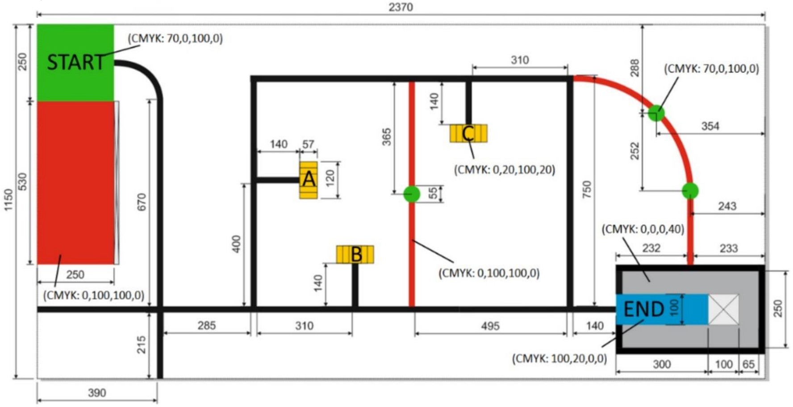
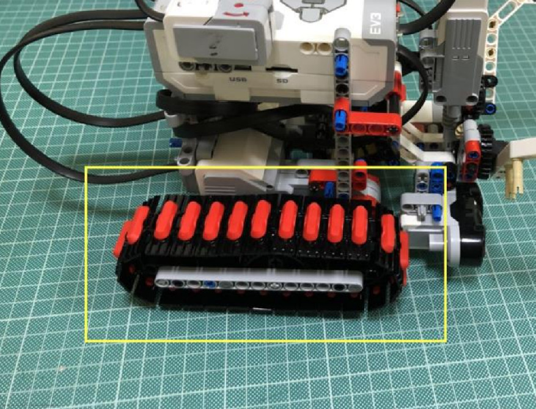
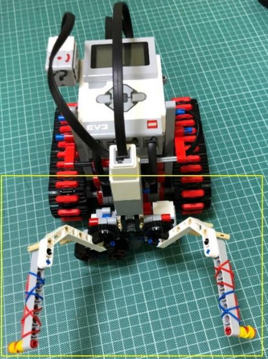
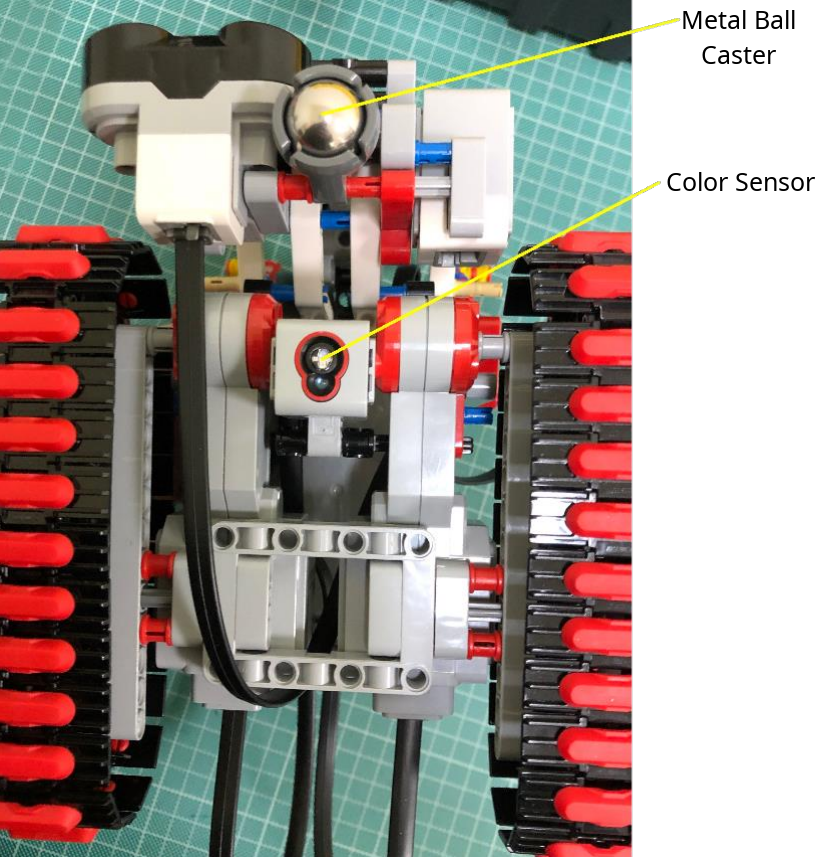
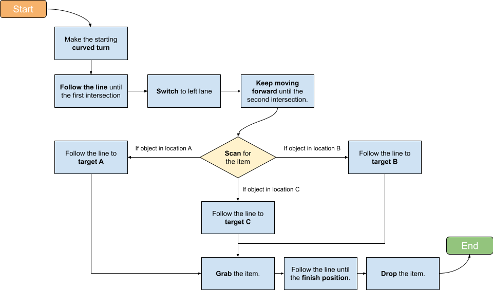
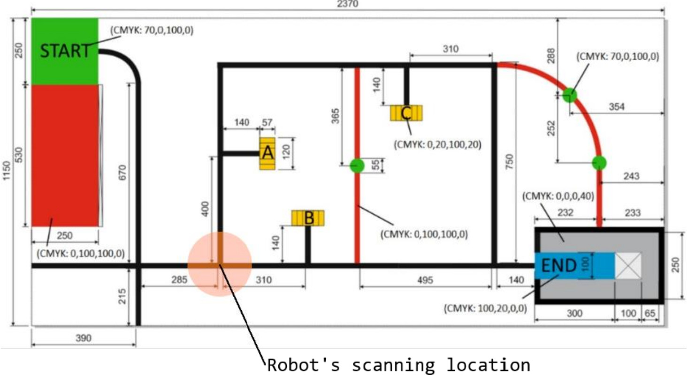

# Task

The task of this project is to design and program a mobile robot (EV3 microcontroller)
capable of navigating a preset arena as depicted below, locate and go grab an item placed randomly in one of the three target locations.

# Robot Design

## Sensors

The robot utilizes 3 sensors in total:

1. **Ultrasonic** &rarr; Measures the distance between arena objects; knowing when to stop.

2. **Color** &rarr; For following the arena's line.

3. **Gyro** &rarr; For making precise degree turns.

The program combines the use of all those sensors to solve more complex problems such as detecting where the item is located in the arena.

## Movement

[Tracks](https://www.lego.com/cdn/product-assets/product.bi.additional.extra.pdf/31313_X_TRACK3R.pdf "build instructions") have been used for the robot's movement cause of their ability to make precise turns as well as making the robot more stable; preventing it from getting off track caused by arena bumps.

## Claw | Grabbing Mechanism

The [claw](https://youtu.be/PQI66KsRsqM "build guide") utilizes mechanical engineering concepts allowing both the grab and lifting mechanisms to be performed using a single motor. The lift repositioning is crucial in giving the ultrasonic sensor a clear view of the arena which is the robot's primary navigational eyes. Furthermore, rubber bands have been added for better grip.

## Line Following & Weight Support

The color sensor for line following has been placed directly below-in the center of the robot. This placement minimizes the influence of ambient light and shadow changes on sensor readings.

Lastly, a metal *ball caster* has been added to the grabber and ultrasonic holder for the robot not to lean forward due to the weight concentration.

# Logic

## Flowchart

## Item Scan Location

The robot scans the location of the item in the following point in the arena:

